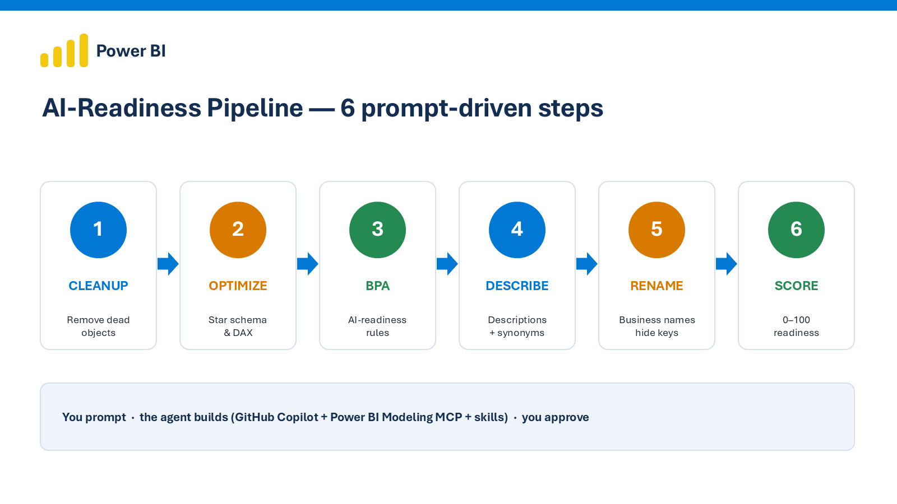

# Power BI → AI-Ready in 6 Steps

> Turn any Power BI semantic model into a **Copilot-ready, agent-friendly** data product —
> guided by your prompts, applied by an agent, approved by you.



[](https://powerbi.microsoft.com/)
[](https://www.microsoft.com/microsoft-fabric)
[](https://github.com/features/copilot)
[](LICENSE)

---

## Why this exists

Soon, we won't build every report — we'll just **ask**, and AI answers. A Copilot data agent can
answer questions straight from your Power BI data… **but only if the model is AI-ready.** AI reads
your model literally: names like `cust_id` or `dt_ky` mean nothing to it, so answers come back weak
or wrong.

This repo is a **prompt-driven pipeline** to fix that — and a **reproducible score** to prove it.

## The idea in one line

**You prompt → the agent builds (GitHub Copilot + Power BI Modeling MCP + skills) → you approve.**

## The 6 steps

| # | Step | What it does |
|---|------|--------------|
| 1 | [Cleanup](steps/01-cleanup/prompt.md) | Find and remove dead measures, unused columns, orphan tables |
| 2 | [Optimize](steps/02-optimize/prompt.md) | Star schema, data types, relationships, simpler DAX |
| 3 | [BPA](steps/03-bpa/prompt.md) | Check against AI-readiness Best Practice rules |
| 4 | [Describe](steps/04-describe/prompt.md) | Generate descriptions + synonyms for every visible object |
| 5 | [Rename](steps/05-rename/prompt.md) | Business-friendly names, hide keys, set format strings |
| 6 | [Score](steps/06-score/prompt.md) | Compute the AI-Readiness Score (0–100) |

Each step is a **prompt** you run with GitHub Copilot (agent mode) against your model through the
Power BI Modeling MCP. You review the proposed changes, then approve. See
[`steps/README.md`](steps/README.md) for how the steps map to the
Analyze → Scope → Audit → Review → Auto-fix → Validate workflow.

## Proof — measured on the sample model

Running the pipeline on the bundled [sample model](sample-model/) (a deliberately un-ready starter):

| | Before | After |
|---|:---:|:---:|
| **AI-Readiness Score** | **12.6 / 100** | **98.5 / 100** |

The 6 steps were run **live through the Power BI Modeling MCP**, and the exported model was scored by
the tool below. Full per-rule breakdown: [docs/before-after.md](docs/before-after.md) — **reproduce them yourself**.

## Quick start

```bash
git clone https://github.com/Dhipikaa1/powerbi-ai-readiness.git
cd powerbi-ai-readiness

# 1) Score the sample models (no dependencies — standard-library Python)
python scoring/ai_readiness_score.py sample-model/before/ContosoRetailMini.SemanticModel
python scoring/ai_readiness_score.py sample-model/after/ContosoRetailMini.SemanticModel

# 2) Run the pipeline on YOUR model:
#    - Connect GitHub Copilot to your model via the Power BI Modeling MCP.
#    - Open each steps/<step>/prompt.md, run it in Copilot agent mode.
#    - Review the proposed changes, approve, and let the agent apply them.
#    - Re-run the scorer to measure the improvement.
```

## Tech stack

- **Microsoft:** Power BI · Microsoft Fabric · TMDL · PBIP
- **AI:** GitHub Copilot (agent mode) · Power BI Modeling MCP · reusable skills
- **Tools:** Tabular Editor (BPA) · VS Code · Python (scorer)
- **Languages:** DAX · M (Power Query) · TMDL · Python

## Repository structure

```
powerbi-ai-readiness/
├── steps/                  # The 6 prompts (+ BPA rules)
│   ├── 01-cleanup/  02-optimize/  03-bpa/
│   └── 04-describe/ 05-rename/    06-score/
├── scoring/                # AI_Readiness_Score.ipynb (live, sempy) + ai_readiness_score.py (offline TMDL)
├── sample-model/           # before/ + after/ TMDL definitions
│   ├── before/  (score 12.6)
│   └── after/   (score 98.5)
├── sample-results/         # real audit Excels from running steps 1 & 2 on the before model
├── results/                # before.json / after.json (scorer output)
├── docs/                   # overview · architecture · before-after · images
├── LICENSE  ·  .gitignore  ·  requirements.txt
```

## Roadmap

- [x] 6-step prompt-driven pipeline
- [x] AI-readiness BPA rules
- [x] Dependency-free scorer (0–100)
- [x] Before/after sample model with measured results
- [ ] Data Agent template + NL-question accuracy harness
- [ ] End-to-end orchestration script
- [ ] Direct push to Fabric via XMLA

## Author

**Dhipikaa Chakka** — Data & AI Engineer · Power BI · Microsoft Fabric · GenAI
🔗 [LinkedIn](https://www.linkedin.com/in/dhipikaachakka) · [GitHub](https://github.com/Dhipikaa1)

> *Pushing BI into the agentic AI era — making semantic models AI-ready and automating the BI
> lifecycle with prompt-driven, human-reviewed workflows.*

⭐ If you find this useful, please star the repo.

## License

MIT — see [LICENSE](LICENSE).
